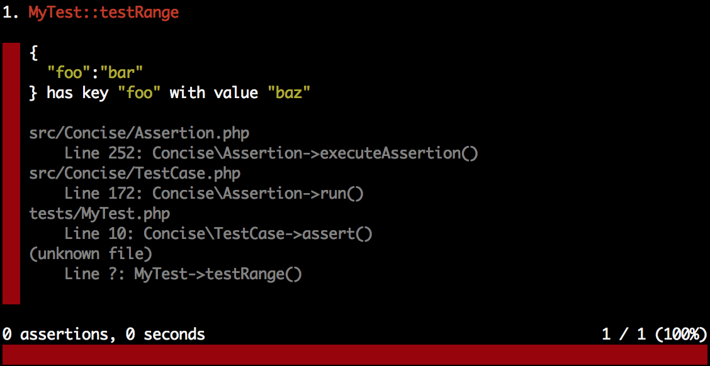

Writing Tests
=============

If your familar with `PHPUnit`_ then there isn't much to explain here. You may
use all the same processes and constructs as PHPUnit - the only difference is
the class you extend from will be ``Concise\Core\TestCase``.

.. _PHPUnit: https://phpunit.de

Simple Example
--------------

.. code-block:: php

   class MyTest extends TestCase
   {
       public function testSomeStuff()
       {
           $result = 100 + 23;
           $this->assert($result)->exactlyEquals(123);

           $a = ['foo' => 'bar'];
           $this->assert($a)->isAnAssociativeArray;
           $this->assert($a)->hasKey('foo'));
       }
   }

Assertions are made from one or more arguments that are a combination of values
and constans that represent strings:

.. code-block:: php

   // ? has key ? with value ?
   $this->assert($a, has_key, 'foo', with_value, 'bar');

Initially this may feel odd. However, this provides very flexible and extremely
readable assertions. As well as easy to understand errors:

.. code-block:: php

   class MyTest extends TestCase
   {
       public function testRange()
       {
           $a = ['foo' => 'bar'];
           $this->assert($a, has_key, 'foo', with_value, 'bar');
       }
   }

Verify vs Assert
----------------

``verify`` is a stand in replacement for ``assert`` that does not stop the
execution of the current test. This is useful when testing several values where
a failure would not cause an error:

.. code-block:: php

   class MyTest extends TestCase
   {
       public function testVerify()
       {
           $this->verify(1, equals, 2);
           $this->verify(2, equals, 2);
           $this->verify(3, equals, 2);
       }
   }

.. image:: _static/fail-verify.png

Nesting Assertions
------------------

Some assertions can be nested becuase they return a value appropriate to what
they are testing if they are successful. For example ``? has key ?`` will return
the value of the key if it does indeed exist. This lets us chain the value into
another assertion that (hopefully) reads as one congruent string:

.. code-block:: php

   class MyTest extends TestCase
   {
       public function testNestedAssertion()
       {
           $a = ['foo' => 1.23];
           $this->assert($this->assert($a, has_key, 'foo'), equals, 1.2, within, 0.1);
       }
   }

Assertions are Just Strings
---------------------------

Assertions at their core are actually just strings. The following code:

.. code-block:: php

   $this->assert($result, exactly_equals, 123);

Is just a builder which is equal to writing:

.. code-block:: php

   $this->assert("$result exactly equals 123");

You may use the latter if you wish but just remember that complex values may not
be escaped correctly when injecting them into a string.

Another case is using attributes in the assertion string:

.. code-block:: php

   class MyTest extends TestCase
   {
       public function testAttributesAreNativelyUnderstood()
       {
           $this->foo = 'bar';
           $this->assert('foo is the same as "bar"');
       }
   }

Use your best judgement to select the best method for the job.
