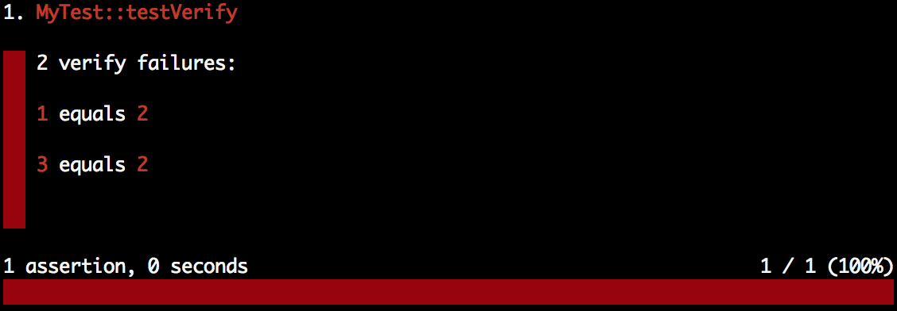

Writing Tests
=============

If you're familar with `PHPUnit`_ then there isn't much to explain here. You may
use all the same processes and constructs as PHPUnit - the only difference is
the class you extend from will be ``Concise\Core\TestCase``.

.. _PHPUnit: https://phpunit.de

Simple Example
--------------

.. code-block:: php

   class MyTest extends TestCase
   {
       public function testSomeStuff()
       {
           $result = 100 + 23;
           $this->assert($result)->exactlyEquals(123);

           $a = ['foo' => 'bar'];
           $this->assertArray($a)->isAssociative;
           $this->assertArray($a)->hasKey('foo');
       }
   }

Assertions are made from chaining words and values together. The chaining
creates the syntax for the assertion:

.. code-block:: php

   // array ? has key ?
   $this->assertArray($a)->hasKey('foo');

This syntax is used to find the assertion. If the assertion fails it will be
able to render the data and the assertion in a pretty way.

Verify vs Assert
----------------

``verify`` is a stand-in replacement for ``assert`` that does not stop the
execution of the current test. This is useful when testing several values where
a failure would not cause an error:

.. code-block:: php

   class MyTest extends TestCase
   {
       public function testVerify()
       {
           $this->verify(1)->equals(2);
           $this->verify(2)->equals(2);
           $this->verify(3)->equals(2);
       }
   }

